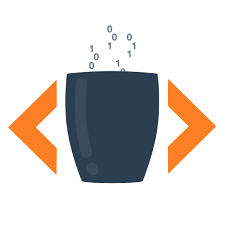

# Hello, world! I'm Charaktane. 👋✨

  <h2>Welcome to my world of code and caffeine. 🖥️☕ You might think you know what's going on here, but trust me, you don't.</h2>
  
  <h3>🌙 A Little About Me (Not that you really care)</h3>
  <ul>
    <li>🖤 Night owl programmer who works best when everyone else is sleeping. Don't interrupt me.</li>
    <li>🚀 I explore technology the same way House explores diagnoses — with contempt and, sometimes, bursts of brilliance.</li>
    <li>☕ My fuel: coffee, chocolate, and a little chaos. What else do you need?</li>
    <li>🕹️ Gaming, coding, and fixing broken things — that's my idea of fun.</li>
  </ul>

  <h3>🛠️ Technologies I Support (and sometimes even love)</h3>
  

    
    
  

  
  <h3>📊 My Coding Stats (You're probably not going to be impressed)</h3>
  

  

  <h3> 🔍 My Specialties (Not that you'll understand)</h3>
  <ul>
    <li>Code Analysis — I'll find the bugs in your code before you even realize they exist.</li>
    <li>Debugging — You will beg for mercy. And yes, I will fix it.</li>
  </ul>

  <h3> 💻 Currently Working On: QR-Score</h3>
  <i> It's such a complicated project that even I haven't fully figured it out yet. But don't worry, I will. I always do.</i>

  <h3>🖤 Let's Connect... or Not</h3>
  
 
    
     
  

  <!-- Coffee Image ![Coffee and Code] -->

  

