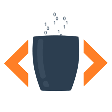

# Hello, world! I'm Suyanne 👋✨

## Welcome

I'm a passionate developer with a strong focus on clean code, debugging, and building meaningful projects. I work best at night, fueled by chocolate and curiosity. When I'm not coding, I'm exploring new technologies, solving problems, or immersed in games and technical challenges.

---

### 🌟 About Me
  
- 🔍 Dedicated to code analysis, optimization, and clean architecture  
- ⚙️ Curious by nature — always exploring new tools and methods  
- ☕ Productivity fuel: chocolate, and continuous learning  
- 🎮 Gamer at heart with a love for breaking and fixing things  

---

### 🛠️ Technologies & Tools

---

### 💻 Code Editors I Use

---

### 📊 GitHub Stats

---

### 🔧 Areas of Expertise

- **Code Analysis** – Identifying bugs and inefficiencies in existing codebases  
- **Debugging** – Skilled at diagnosing and resolving complex issues  

---

### Current Project

- Studying data structures and improving projects in Java and Python.

---

### 📫 Let's Connect

  

---

---

  

